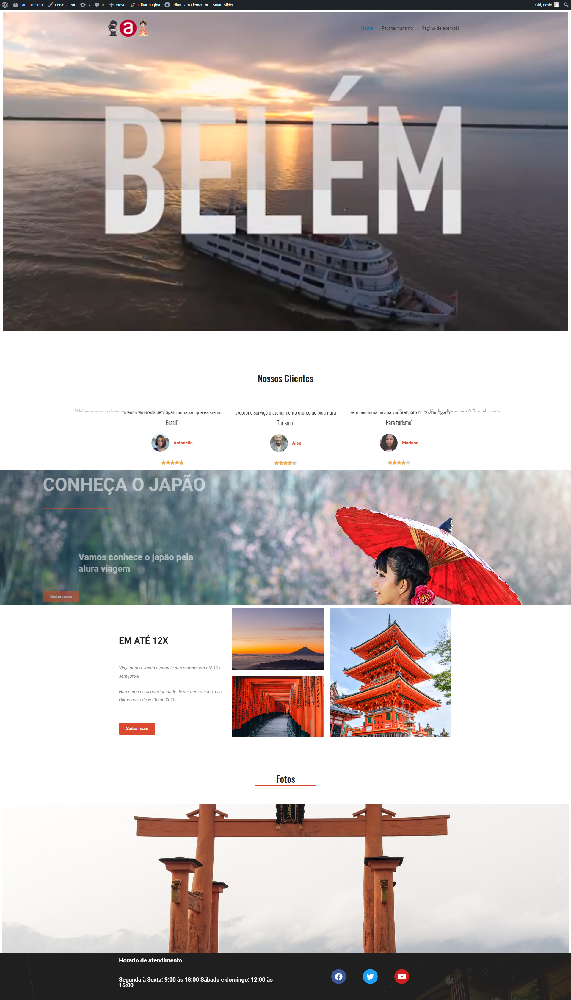

<h1 align="center">
 
  
 
 
Para Turismo
</h1>

Projeto feito pela alura apenas para exercita conhecimentos no framework wordpress

  

    
 

## Tecnologia usada

Usado do php puro, no servidor linux 

- ⚛️ **Javascript** — animações
- ⚛️ **PHP** — PHP para servidor linux
- 💹 **Worpress** — framework, Elementor,Smart Slider 3(galeria)VVAme chat(chat whatzap)Essential Addons for Elementor (intergração com post) 
- 💹 **MYSQL** — BD para conteudo

## Modelos

1. Todos os direito autoras pela david: 
3. Modelo apenas ilustratorio 

### Equipe de desenvolvimento

1. David orion (webdeveloper)

